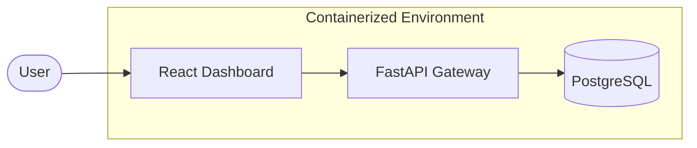

# 🍃 EcoTrack | Enterprise SaaS Sustainability Dashboard

[](https://fastapi.tiangolo.com/)
[](https://reactjs.org/)
[](https://www.postgresql.org/)
[](https://www.docker.com/)

**EcoTrack** is a high-performance, containerized SaaS platform designed for enterprises to monitor and optimize their sustainability footprint. Built with a focus on scalability, clean architecture, and premium user experience.

---

## 🎯 Project Overview

This project was developed to showcase full-stack engineering proficiency for **Cloud/SaaS internship roles in Poland**. It demonstrates modern development practices including:
- **Clean Architecture:** Modular backend structure with separated models, schemas, and logic.
- **RESTful API Design:** Industry-standard API patterns with automatic documentation.
- **Microservices:** Fully containerized setup using Docker Compose.
- **Modern UI/UX:** Premium dark-themed dashboard built with Tailwind CSS and Recharts.

---

## ✨ Features

- **📊 Real-time Dashboard:** Visualize Carbon Offset, Energy Savings, and Water Recovery with dynamic charts.
- **📝 Analytics Logging:** Robust API for tracking sustainability events across different categories.
- **⚡ High Performance:** Frontend built with Vite for sub-second hot-reloads and optimized builds.
- **🛠️ Fully Typed:** Backend leveraging Pydantic for strict data validation and type safety.
- **🧪 Testing Ready:** Integrated Pytest suite for backend health and logic verification.

---

## 🏗️ Architecture



---

## 🛠️ Technical Implementation

### Backend (Python/FastAPI)
- **Dependency Injection:** Modular service architecture using `Depends`.
- **ORM:** SQLAlchemy for robust PostgreSQL communication.
- **Documentation:** Automatic OpenAPI (Swagger) documentation.

### Frontend (React/JS)
- **Component Pattern:** Atomic structure with reusable Sidebar, Header, and StatCards.
- **Animations:** Subtle transitions and pulse effects for a premium "live" feel.
- **Data Viz:** Recharts for complex data representation.

---

## 🚀 Getting Started

### Prerequisites
- Docker & Docker Compose

### Fast Launch
```bash
# Clone & Navigate
git clone https://github.com/OykuCngz/saas-analytics-dashboard.git
cd saas-analytics-dashboard

# Build and Start
docker-compose up --build
```

| Service | URL |
| :--- | :--- |
| **Frontend** | [http://localhost:5173](http://localhost:5173) |
| **API Docs** | [http://localhost:8000/docs](http://localhost:8000/docs) |

---

## 🇵🇱 Focus for Poland Market
Designed with European enterprise standards in mind:
- **Scalability:** Ready for high-traffic analytical data.
- **Maintainability:** Strict folder structure and documentation.
- **Quality:** Integrated testing and Dockerized deployment.

---
*Created by Öykü Cengiz - Aspiring Software Engineer*
